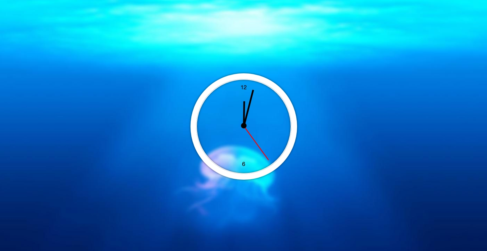

> [Javascript30 天挑戰](https://github.com/wesbos/JavaScript30)。挑戰只能使用純 Js 來撰寫，不能使用其他框架或是 Library，總共有 30 道題，我會紀錄我挑戰過程遇到的問題和解法。

# 02 - Js and CS Clock

## :eyes: Introduction



### Main goals

- Create a clock that updates in real time.

### Demo: 👉 [Click me](https://henryjheng-dev.github.io/Javascript30-solution-notes/02-JS-and-CS-Clock/)

## Design & Implementation

Start by using Date() to get the current time. Extract the seconds, minutes, and hours individually, convert each to the corresponding angle on the circle, and then use setInterval to update the clock in real time.

## :pushpin: Key Techniques

### 1. Get current time

Use `new Date()` to get current time.

```javascript
const currentTime = new Date();
```

### 2. Time conversion

Convert the current seconds into a fraction of a full rotation, map that fraction to an angle on the circle, and add +90° to compensate for the .hand element's initial 90° CSS rotation.

```javascript
const secondsDegrees = (seconds / 60) * 360 + 90;
```

Add the seconds' converted angle to the minute hand's angle calculation so the minute hand moves smoothly in sync with the seconds.（Same for hours）

```javascript
const minsDegrees = (mins / 60) * 360 + (seconds / 60) * 6 + 90;
```

### 3. Periodic real-time updates

```javascript
setInterval(updateClock, 1000);
```
